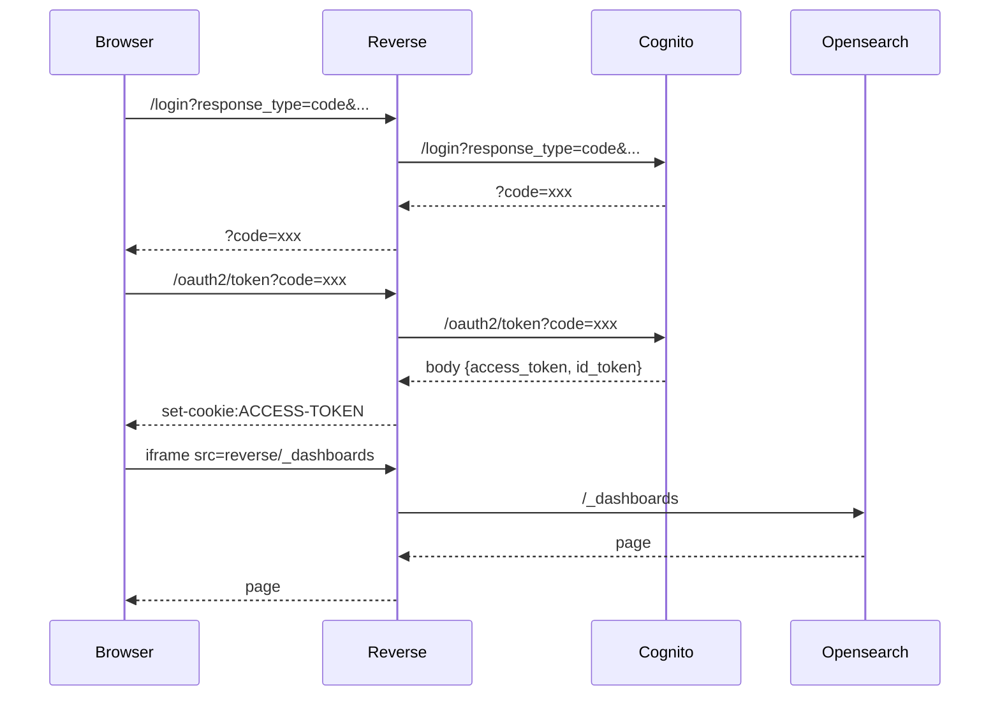

# Opensearch dashboard inside an iframe 

## Project 

This is a small project that allows to include AWS Opensearch dashboard (Kibana) inside an IFrame (using React). The use of React is just to make it easier to manage routes (this can be done with Angular, Vue or vanilla JS).

### How to run 

* Edit nginx.conf to match your opensearch (dashboard_host) and cognito (cognito_host) endpoints 
* Edit auth.js to match your cognito endpoint and authorization header (Authorization header is base64 applied to "cliend_id:client_secret")
* Start reverse `cd reverse` `docker-compose up`
* Start react `cd front` `npm start`
* Open a browser at `http://localhost:3000`

## Issue 

Opensearch doesn't allow to include the dashboard inside an IFrame using the same authentication. 

## Solution

Use a reverse proxy to modify headers and convert /oauth2/token response to cookies.

### NGINX configuration

* Requests to `/login` are proxied to cognito (`/login`)
* Requests to `/_dashboards` are proxied to opensearch (`/_dashboards`)
* Requests to `/oauth2/token` are processed by JS inside NGINX (file `auth.js`)
