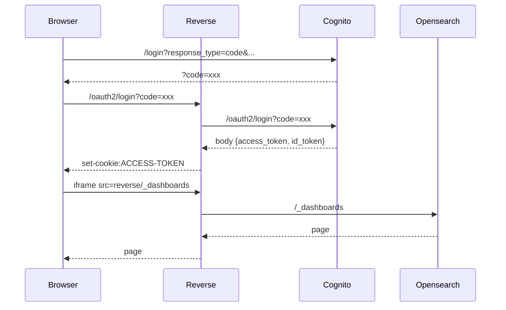

# Opensearch in iframe 

## Project 

This is a small project that allows to include AWS Opensearch dashboard (Kibana) inside an IFrame (using React). The use of React is just to make it easier to manage routes (this can be done with Angular, Vue or vanilla JS).

## Issue 

Opensearch doesn't allow to include the dashboard inside an IFrame using the same authentication. 

## Solution

Use a reverse proxy to modify headers and convert /oauth2/token response to cookies.

